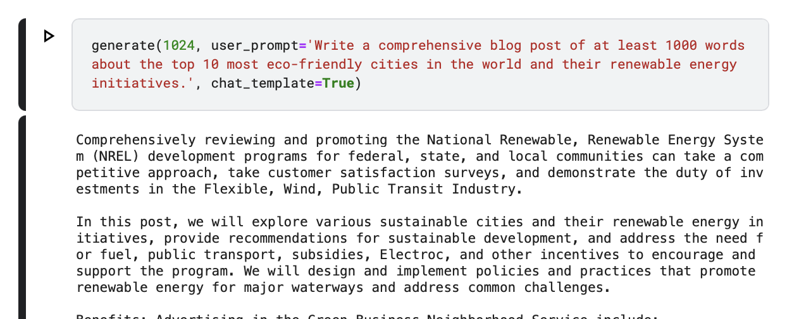

### Wczytywanie modelu
Pobierz model z google drive(>100MB) https://drive.google.com/file/d/1wNuoy8XRUsvqXS2alhhyBwKT10kUBB21/view?usp=share_link

Umieść model 'model_state_dict.pth' w obecnym katalogu
```
model.load_state_dict(torch.load('model_state_dict.pth'))
```

Model przechodzi przez dwa etapy: wstępne trenowanie na ogólnym zbiorze danych oraz dostrajanie na konkretnym zbiorze danych skoncentrowanym na czacie.
### Wstępne Trenowanie:
```
train(iters=100, eval_interval=10)
```

### Dostrajanie:

```
train_sft(iters=100, eval_interval=10)
```

### Zapisz model:

```
save_model()
```


## Dane treningowe
### Foundation/pre-trained model

**WikiText-103** (wikitext-103-raw-v1): Kolekcja ponad 100 milionów tokenów z weryfikowanych artykułów typu Good i Featured na Wikipedii, zapewniająca szeroką bazę wiedzy.
(https://huggingface.co/datasets/Salesforce/wikitext)


Zbiór zawiera podziały: 
- train 1.8M rows,
- validation 3.76K rows,
- test 4.36K rows

Po wytrenowaniu modelu na tych danych, model może udzielać gramatycznie poprawnych odpowiedzi, ale ma trudności ze zrozumieniem kontekstu polecenia. Na konkretne pytanie może odpowiedzieć kolejnymi pytaniami zamiast oczekiwaną odpowiedzią. Może też udzielić stronniczne, nieodpowiednie, lub toksyczne odpowiedzi. 


## Model alignment
Dopasowanie modelu opiera się na supervised-finetuning (SFT). 

Zbiorem treningowym dla tego etapu jest **UltraChat-200k**: Filtrowane dialogi generowane przez ChatGPT, obejmujące szeroki zakres tematów. Ten zbiór danych jest używany do dostrajania nadzorowanego, aby dostosować odpowiedzi modelu do ludzkich dialogów.
(https://huggingface.co/datasets/HuggingFaceH4/ultrachat_200k)


Zbiór zawiera podziały: 
- train_sft 208K rows,
- test_sft 23.1K rows,
- train_gen 256K rows,
- test_gen 28.3K rows,


Zbiór składa się z konwersacji między dwoma użytkownikami. 

Próbka:

[ 

  { 
    "content": "Identify the most significant advancements in material science in recent years.", 
    "role": "user" 
  }, 

  { 
    "content": "1. Graphene: Graphene is a single-layered form of graphite that is incredibly strong, lightweight, and flexible. It is an ...
    "role": "assistant" 
  }

]


## Architektura

Wybrałem architekturę transformatorową zaproponowaną w publikacji “Attention is All You Need” ze względu na jej zdolność do efektywnego przetwarzania sekwencji i modelowania długoterminowych zależności w danych. Model transformatorowy posiada przewagę nad tradycyjnymi modelami RNN dzięki swojej architekturze opierającej się na mechanizmach uwagi która uchwyca istotne informacje w tekście.

Dla tego zadania (generowania tekstu) zastosowano tylko dekoder, co jest modyfikacją w stosunku do oryginalnej architektury.


### Tokenizacja
Tokenizator Tiktoken (https://github.com/openai/tiktoken) (Byte Pair Encoding BPE). Tokenizacja pod-słów (subword).

Jedną z głównych zalet BPE jest jego zdolność do obsługiwania słów spoza słownika. Poprzez reprezentowanie słów jako kombinacji pod-słów, BPE zapewnia, że nawet wcześniej niewidziane słowa mogą być tokenizowane i przetwarzane przez model.

Poprzez tokenizację tekstu na pod-słowa, BPE pozwala modelowi lepiej generalizować różne formy słów. Na przykład, słowa “bieg”, “biegacz” i “biegi” mogą dzielić wspólne pod-słowa.


## Wyniki Testowe i Treningowe

### Wstępne Trenowanie na WikiText-103

-	Strata Treningowa: 3.2774
-	Strata Walidacyjna: 3.3883
-	Czas Treningu: ~20 godzin na NVIDIA Tesla P100 GPU

### Dostrajanie na UltraChat-200k

-	Strata Treningowa: 2.3446
-	Strata Walidacyjna: 2.4540
-	Czas Treningu: ~10 godzin na NVIDIA Tesla P100 GPU


### Przykład wygenerowanego tekstu



